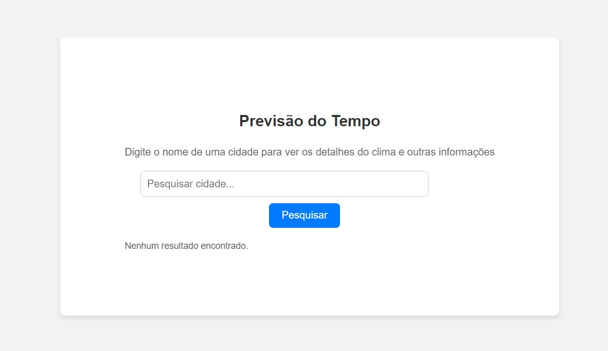
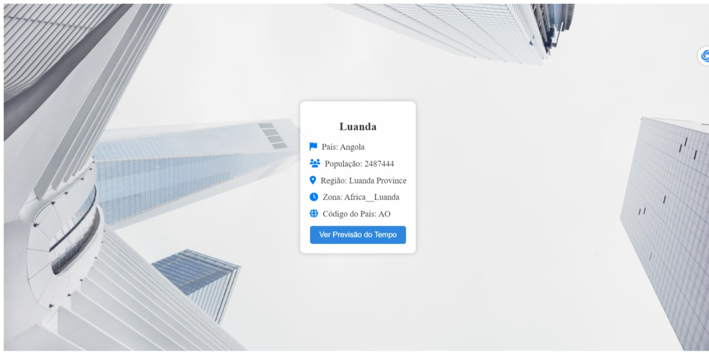
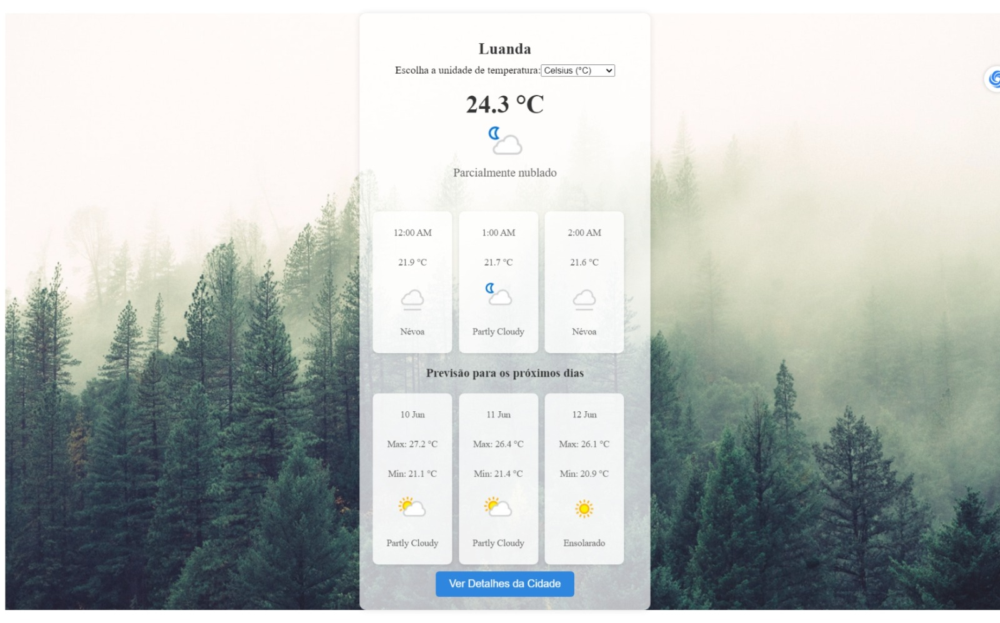

# Weather App - Documentação de uso e Instruções Docker
Este é um aplicativo de previsão do tempo desenvolvido como parte do  teste... Ele permite aos usuários buscar informações meteorológicas de diferentes cidades.

# Funcionalidades
- Busca por nome de cidade para obter informações detalhadas.
- Exibição de previsão do tempo atual e dos próximos dias.
- Unidade de temperatura configurável (Celsius ou Fahrenheit).
- Interface responsiva e intuitiva.

# Pré-requisitos
Antes de iniciar, verifique se você tem instalado:

- Docker
- Node.js (Opcional para desenvolvimento local)

# Instruções para construção e Execução

### Clonando o Repositório:

``git clone https://github.com/JohnBraga45/withustest_.git``

``cd withustest_``

### Construindo a Imagem Docker:

##### Certifique-se de estar no diretório raiz do projeto que contém o arquivo Dockerfile.

``docker build -t my-weather-app .``

### Executando o Contêiner Docker:

Inicie um contêiner Docker com o aplicativo em execução:

``docker run -p 80:80 my-weather-app``

### Acessando o Aplicativo:
Abra um navegador da web e navegue para http://localhost:80 para acessar o aplicativo de previsão do tempo.

# Outra Opção
Importar a imagem Docker usando o comando ``docker load -i my-weather-app.tar``

### Verificar a Importação:
Após a importação, pode verificar se a imagem foi importada corretamente usando o comando :
``docker images
``

## Notas Adicionais
Certifique-se de que tenham o Docker instalado em seus sistemas para importar e executar a imagem Docker.

## Prints de tela

#### Tela Inicial

- Tela principal para pesquisar as cidades.

#### Exemplo de Busca por Cidade

- Exemplo do resultado de uma pesquisa pela cidade de Luanda.

#### Apresentação da cidade

- Apresentação dos detalhes da cidade pesquisada.

#### Exemplo de Busca por Cidade

- Apresentação dos detalhes daos detalhes do tempo da cidade pesquisada.
